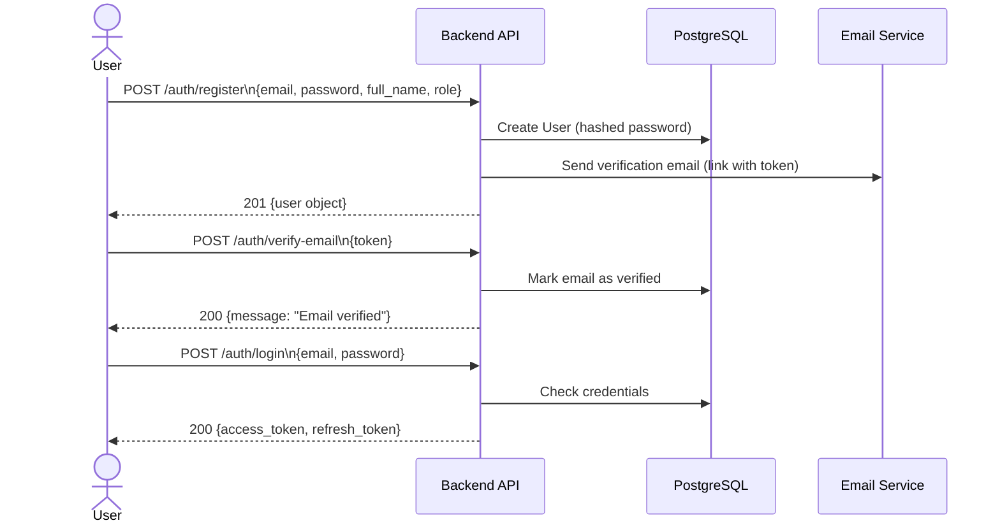
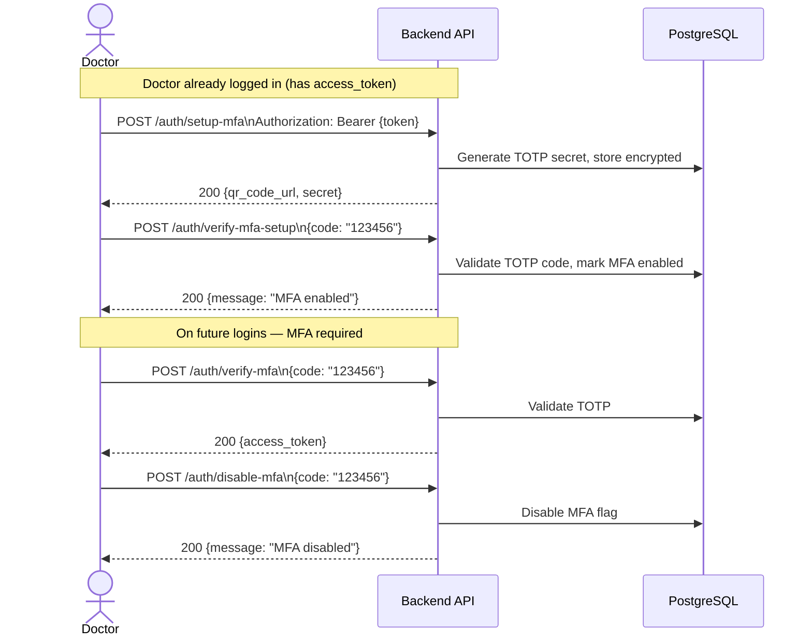
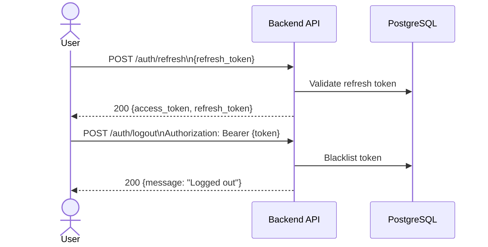
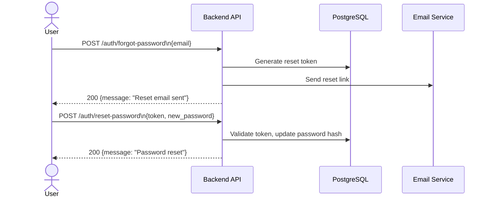
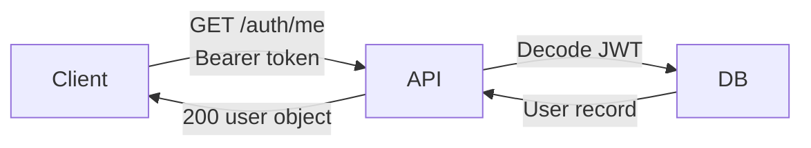

# Authentication Flow

## 1. Standard Registration & Login

---

## 2. MFA (Multi-Factor Authentication) Setup

---

## 3. Token Refresh & Logout

---

## 4. Password Reset

---

## 5. Get Current User Info

