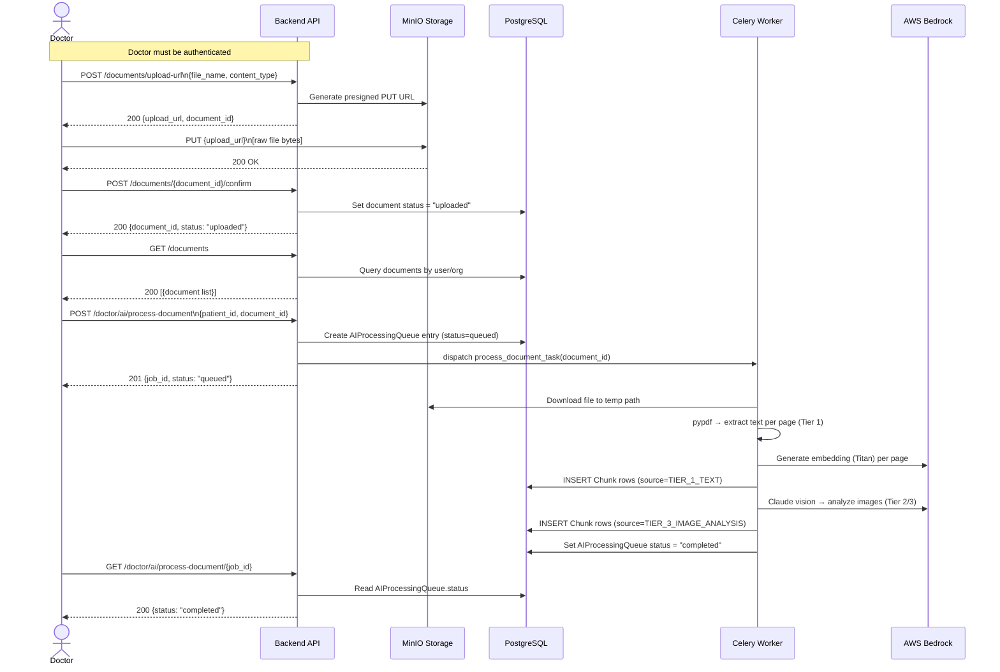
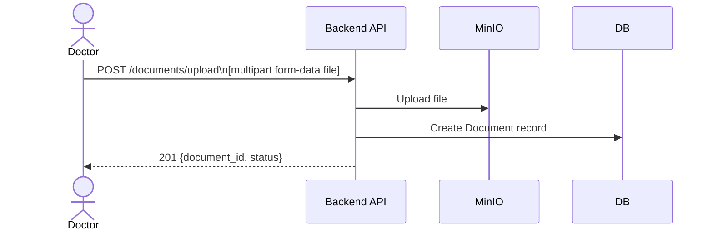
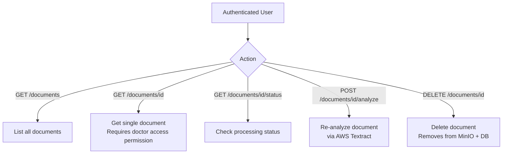

# Document Upload & AI Processing Flow

## 1. Full Document Upload → AI Processing Pipeline

```mermaid
sequenceDiagram
    actor Doctor
    participant API as Backend API
    participant MinIO as MinIO Storage
    participant DB as PostgreSQL
    participant Worker as Celery Worker
    participant Bedrock as AWS Bedrock

    Note over Doctor,API: Doctor must be authenticated

    %% Step 1: Get presigned upload URL
    Doctor->>API: POST /documents/upload-url\n{file_name, content_type}
    API->>MinIO: Generate presigned PUT URL
    API-->>Doctor: 200 {upload_url, document_id}

    %% Step 2: Upload file directly to MinIO
    Doctor->>MinIO: PUT {upload_url}\n[raw file bytes]
    MinIO-->>Doctor: 200 OK

    %% Step 3: Confirm upload
    Doctor->>API: POST /documents/{document_id}/confirm
    API->>DB: Set document status = "uploaded"
    API-->>Doctor: 200 {document_id, status: "uploaded"}

    %% Step 4: List & verify
    Doctor->>API: GET /documents
    API->>DB: Query documents by user/org
    API-->>Doctor: 200 [{document list}]

    %% Step 5: Trigger AI processing
    Doctor->>API: POST /doctor/ai/process-document\n{patient_id, document_id}
    API->>DB: Create AIProcessingQueue entry (status=queued)
    API->>Worker: dispatch process_document_task(document_id)
    API-->>Doctor: 201 {job_id, status: "queued"}

    %% Background: Worker processes document
    Worker->>MinIO: Download file to temp path
    Worker->>Worker: pypdf → extract text per page (Tier 1)
    Worker->>Bedrock: Generate embedding (Titan) per page
    Worker->>DB: INSERT Chunk rows (source=TIER_1_TEXT)
    Worker->>Bedrock: Claude vision → analyze images (Tier 2/3)
    Worker->>DB: INSERT Chunk rows (source=TIER_3_IMAGE_ANALYSIS)
    Worker->>DB: Set AIProcessingQueue status = "completed"

    %% Step 6: Poll for completion
    Doctor->>API: GET /doctor/ai/process-document/{job_id}
    API->>DB: Read AIProcessingQueue.status
    API-->>Doctor: 200 {status: "completed"}
```

---

## 2. Simple Direct Upload (without presigned URL)

```mermaid
sequenceDiagram
    actor Doctor
    participant API as Backend API
    participant MinIO as MinIO

    Doctor->>API: POST /documents/upload\n[multipart form-data file]
    API->>MinIO: Upload file
    API->>DB: Create Document record
    API-->>Doctor: 201 {document_id, status}
```

---

## 3. Document Management Operations

```mermaid
flowchart TD
    A[Authenticated User] --> B{Action}

    B -->|GET /documents| C[List all documents]
    B -->|GET /documents/id| D[Get single document\nRequires doctor access permission]
    B -->|GET /documents/id/status| E[Check processing status]
    B -->|POST /documents/id/analyze| F[Re-analyze document\nvia AWS Textract]
    B -->|DELETE /documents/id| G[Delete document\nRemoves from MinIO + DB]
```
