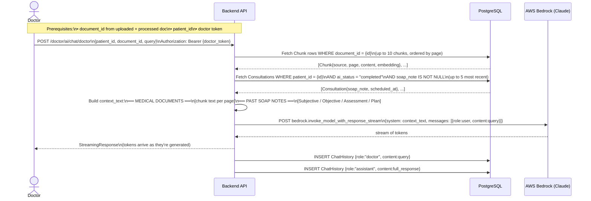
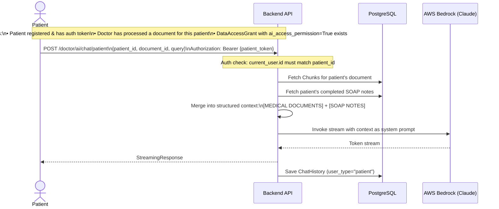
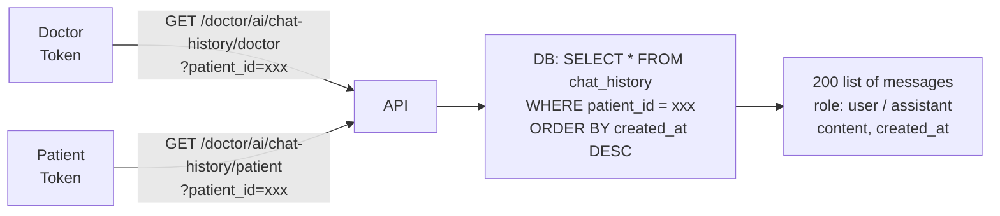
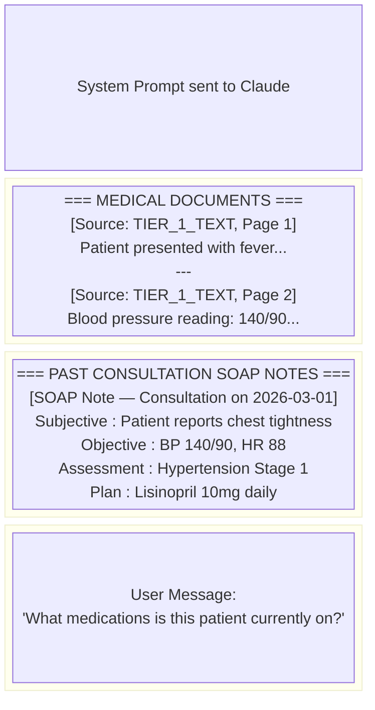

# AI Chat Flow (RAG — Retrieval Augmented Generation)

## 1. Doctor Chats About a Patient's Medical Data



---

## 2. Patient Chats About Their Own Data



---

## 3. Retrieve Chat History



---

## 4. RAG Context Structure (What Claude Receives)



---

## 5. Full Permission → Chat Prerequisite Flow

```mermaid
flowchart TD
    A[Doctor registers & logs in] --> B[Doctor creates Patient profile\nPOST /patients]
    B --> C[Doctor uploads document\nPOST /documents/upload]
    C --> D[Doctor processes document for AI\nPOST /doctor/ai/process-document]
    D --> E{Poll status}
    E -->|status != completed| E
    E -->|status = completed| F[Patient registers auth account\nPOST /auth/register]
    F --> G[Patient grants doctor access\nPOST /permissions/grant-doctor-access\n{ai_access_permission: true}]
    G --> H[Doctor chats\nPOST /doctor/ai/chat/doctor]
    G --> I[Patient chats\nPOST /doctor/ai/chat/patient]
