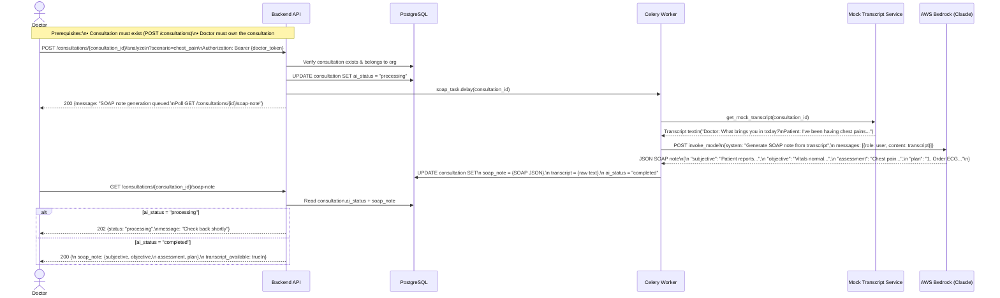
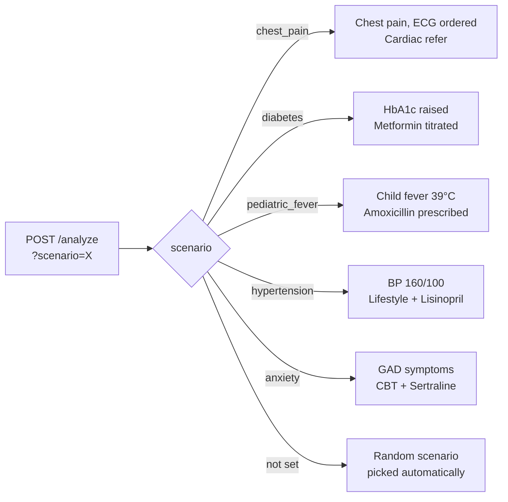
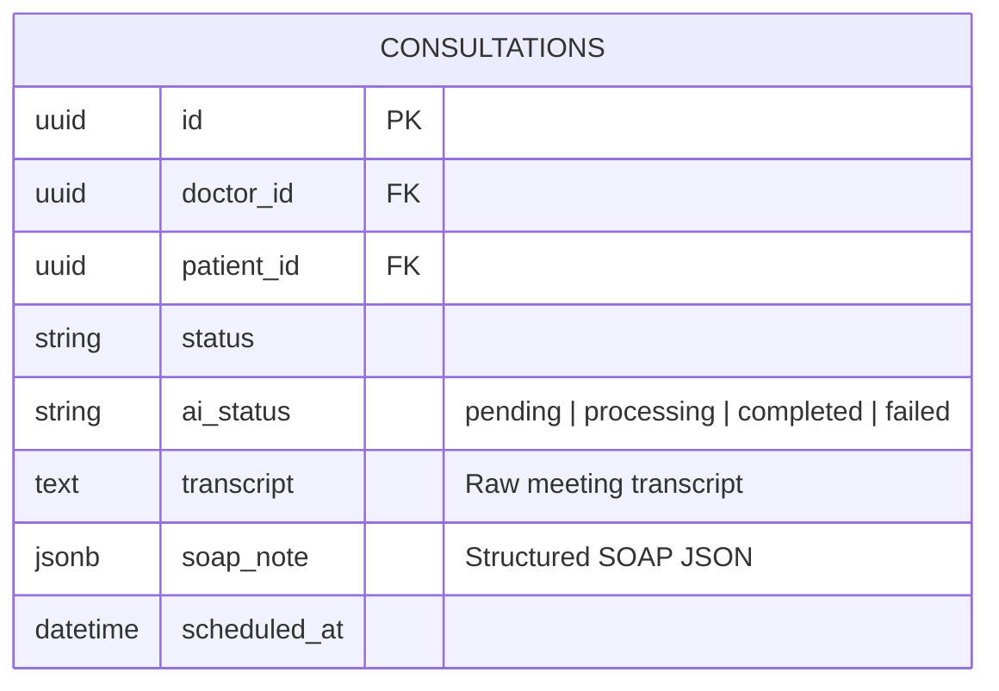
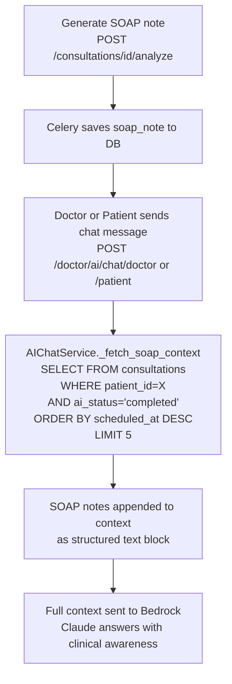

# SOAP Note Generation Flow

## 1. Full SOAP Note Pipeline

```mermaid
sequenceDiagram
    actor Doctor
    participant API as Backend API
    participant DB as PostgreSQL
    participant Worker as Celery Worker
    participant MockTx as Mock Transcript Service
    participant Bedrock as AWS Bedrock (Claude)

    Note over Doctor,API: Prerequisites:\n• Consultation must exist (POST /consultations)\n• Doctor must own the consultation

    %% Step 1: Trigger generation
    Doctor->>API: POST /consultations/{consultation_id}/analyze\n?scenario=chest_pain\nAuthorization: Bearer {doctor_token}

    API->>DB: Verify consultation exists & belongs to org
    API->>DB: UPDATE consultation SET ai_status = "processing"
    API->>Worker: soap_task.delay(consultation_id)
    API-->>Doctor: 200 {message: "SOAP note generation queued.\nPoll GET /consultations/{id}/soap-note"}

    %% Background: Celery Worker executes
    Worker->>MockTx: get_mock_transcript(consultation_id)
    MockTx-->>Worker: Transcript text\n("Doctor: What brings you in today?\nPatient: I've been having chest pains...")

    Worker->>Bedrock: POST invoke_model\n{system: "Generate SOAP note from transcript",\n messages: [{role: user, content: transcript}]}

    Bedrock-->>Worker: JSON SOAP note\n{\n  "subjective": "Patient reports...",\n  "objective": "Vitals normal...",\n  "assessment": "Chest pain...",\n  "plan": "1. Order ECG..."\n}

    Worker->>DB: UPDATE consultation SET\n  soap_note = {SOAP JSON},\n  transcript = {raw text},\n  ai_status = "completed"

    %% Step 2: Poll for result
    Doctor->>API: GET /consultations/{consultation_id}/soap-note
    API->>DB: Read consultation.ai_status + soap_note

    alt ai_status = "processing"
        API-->>Doctor: 202 {status: "processing",\nmessage: "Check back shortly"}
    else ai_status = "completed"
        API-->>Doctor: 200 {\n  soap_note: {subjective, objective,\n              assessment, plan},\n  transcript_available: true\n}
    end
```

---

## 2. Available Test Scenarios

```mermaid
flowchart LR
    A[POST /analyze\n?scenario=X] --> B{scenario}

    B -->|chest_pain| C["Chest pain, ECG ordered\nCardiac refer"]
    B -->|diabetes| D["HbA1c raised\nMetformin titrated"]
    B -->|pediatric_fever| E["Child fever 39°C\nAmoxicillin prescribed"]
    B -->|hypertension| F["BP 160/100\nLifestyle + Lisinopril"]
    B -->|anxiety| G["GAD symptoms\nCBT + Sertraline"]
    B -->|not set| H["Random scenario\npicked automatically"]
```

---

## 3. SOAP Note Database Storage

```mermaid
erDiagram
    CONSULTATIONS {
        uuid id PK
        uuid doctor_id FK
        uuid patient_id FK
        string status
        string ai_status "pending | processing | completed | failed"
        text transcript "Raw meeting transcript"
        jsonb soap_note "Structured SOAP JSON"
        datetime scheduled_at
    }
```

---

## 4. How SOAP Notes Feed Into AI Chat

```mermaid
flowchart TD
    A[Generate SOAP note\nPOST /consultations/id/analyze] --> B[Celery saves soap_note to DB]
    B --> C[Doctor or Patient sends chat message\nPOST /doctor/ai/chat/doctor or /patient]
    C --> D[AIChatService._fetch_soap_context\nSELECT FROM consultations\nWHERE patient_id=X\nAND ai_status='completed'\nORDER BY scheduled_at DESC\nLIMIT 5]
    D --> E[SOAP notes appended to context\nas structured text block]
    E --> F[Full context sent to Bedrock\nClaude answers with clinical awareness]
```
