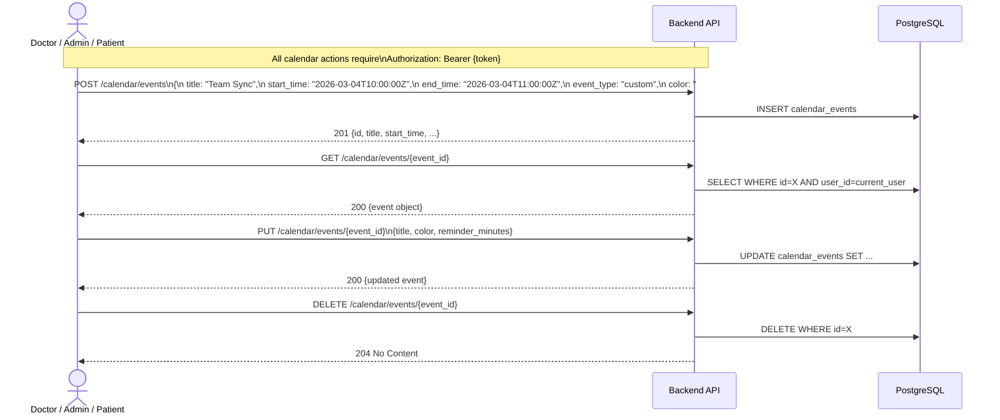
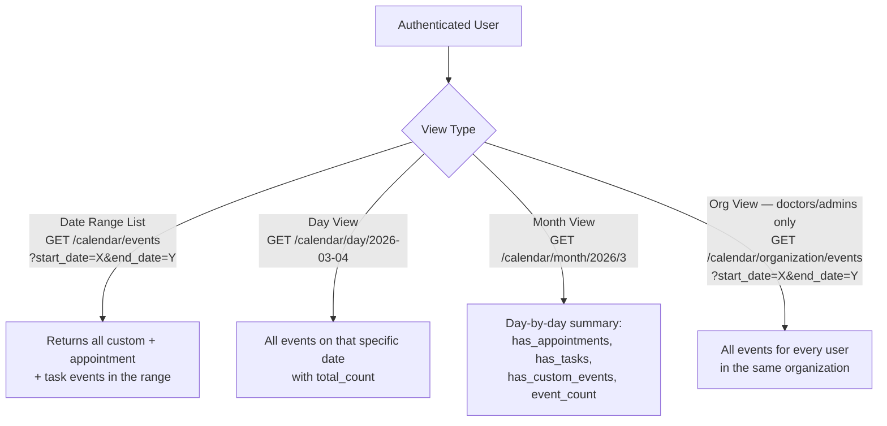
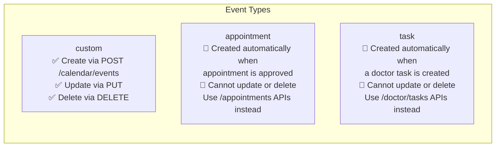
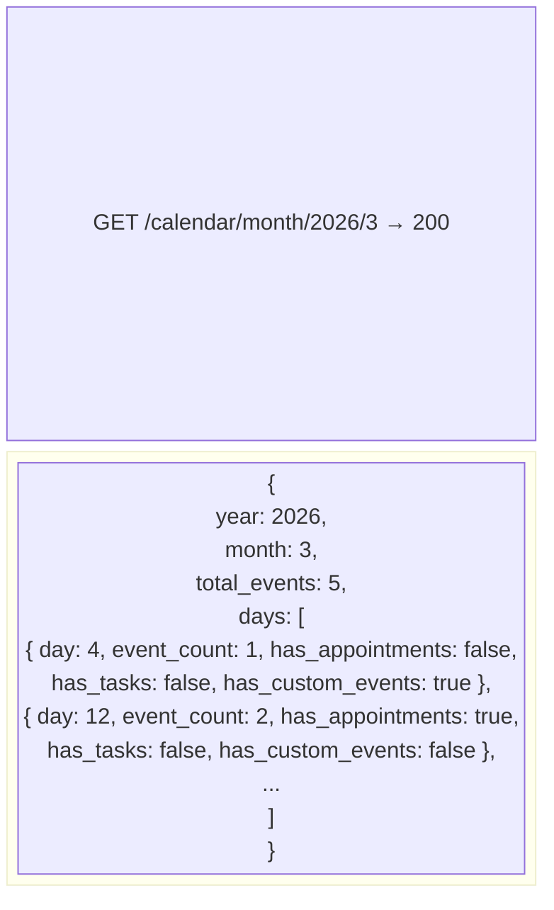

# Calendar Feature Flow

## 1. Full Calendar CRUD Lifecycle

```mermaid
sequenceDiagram
    actor User as Doctor / Admin / Patient
    participant API as Backend API
    participant DB as PostgreSQL

    Note over User,API: All calendar actions require\nAuthorization: Bearer {token}

    %% Create
    User->>API: POST /calendar/events\n{\n  title: "Team Sync",\n  start_time: "2026-03-04T10:00:00Z",\n  end_time: "2026-03-04T11:00:00Z",\n  event_type: "custom",\n  color: "#4A90E2",\n  reminder_minutes: 15\n}
    API->>DB: INSERT calendar_events
    API-->>User: 201 {id, title, start_time, ...}

    %% Read single
    User->>API: GET /calendar/events/{event_id}
    API->>DB: SELECT WHERE id=X AND user_id=current_user
    API-->>User: 200 {event object}

    %% Update
    User->>API: PUT /calendar/events/{event_id}\n{title, color, reminder_minutes}
    API->>DB: UPDATE calendar_events SET ...
    API-->>User: 200 {updated event}

    %% Delete
    User->>API: DELETE /calendar/events/{event_id}
    API->>DB: DELETE WHERE id=X
    API-->>User: 204 No Content
```

---

## 2. List & View Endpoints

```mermaid
flowchart TD
    A[Authenticated User] --> B{View Type}

    B -->|Date Range List\nGET /calendar/events\n?start_date=X&end_date=Y| C[Returns all custom + appointment\n+ task events in the range]

    B -->|Day View\nGET /calendar/day/2026-03-04| D[All events on that specific date\nwith total_count]

    B -->|Month View\nGET /calendar/month/2026/3| E[Day-by-day summary:\nhas_appointments, has_tasks,\nhas_custom_events, event_count]

    B -->|Org View — doctors/admins only\nGET /calendar/organization/events\n?start_date=X&end_date=Y| F[All events for every user\nin the same organization]
```

---

## 3. Event Type Rules

```mermaid
flowchart LR
    subgraph types["Event Types"]
        A["custom\n✅ Create via POST /calendar/events\n✅ Update via PUT\n✅ Delete via DELETE"]
        B["appointment\n🚫 Created automatically when\nappointment is approved\n🚫 Cannot update or delete\nUse /appointments APIs instead"]
        C["task\n🚫 Created automatically when\na doctor task is created\n🚫 Cannot update or delete\nUse /doctor/tasks APIs instead"]
    end
```

---

## 4. Month View Response Structure

```mermaid
block-beta
    columns 1
    A["GET /calendar/month/2026/3 → 200"]:1

    block:resp
        B["{
  year: 2026,
  month: 3,
  total_events: 5,
  days: [
    { day: 4, event_count: 1, has_appointments: false,
      has_tasks: false, has_custom_events: true },
    { day: 12, event_count: 2, has_appointments: true,
      has_tasks: false, has_custom_events: false },
    ...
  ]
}"]
    end
```
