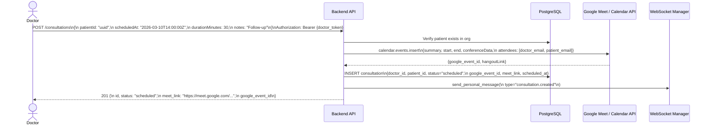
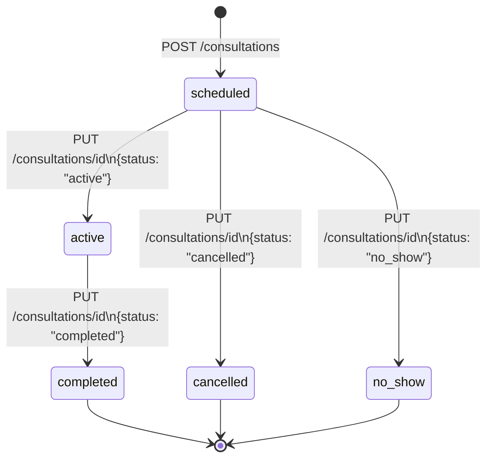
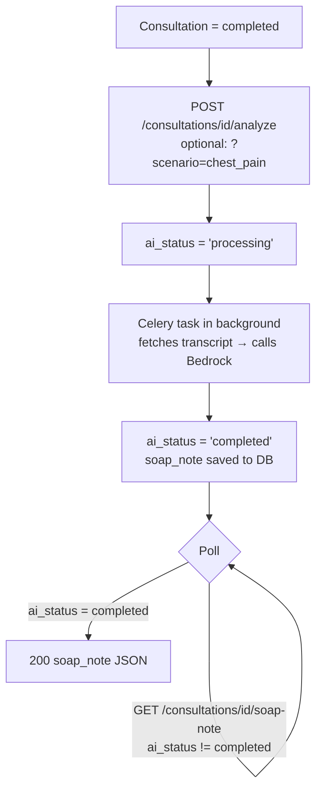
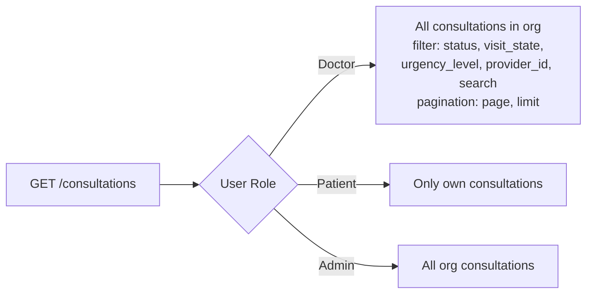
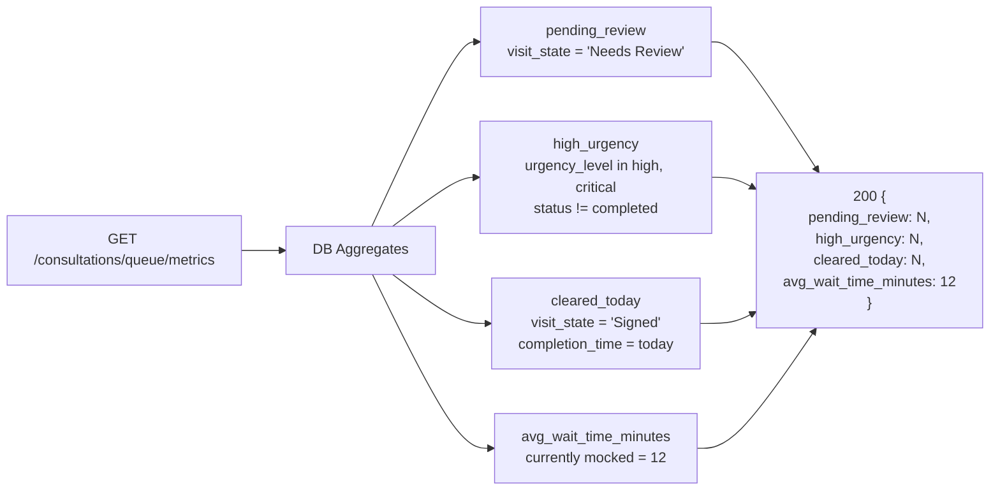

# Consultation Flow

## 1. Schedule a Consultation (with Google Meet)

---

## 2. Manage Consultation Lifecycle

---

## 3. SOAP Note Generation (after consultation)

---

## 4. List & Filter Consultations

---

## 5. Clinical Queue Metrics

