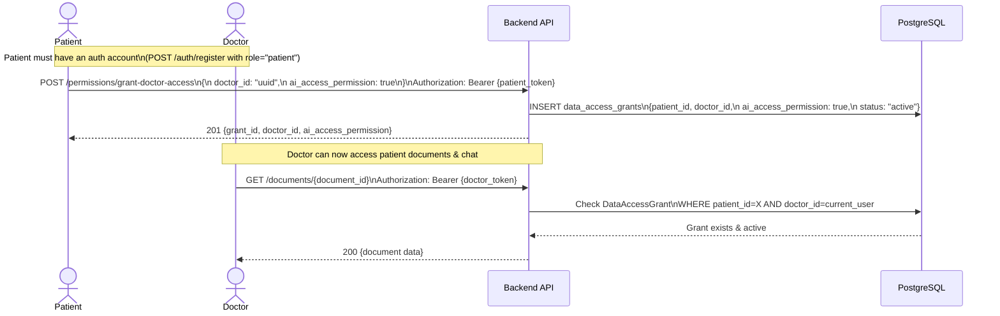
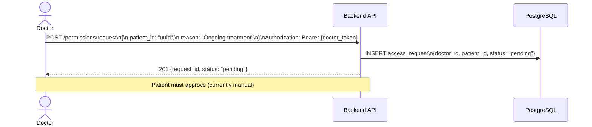
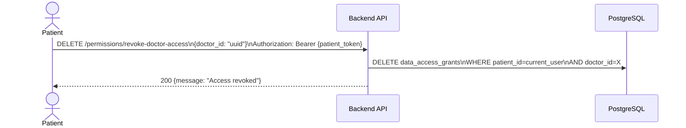

# Permissions & Data Access Grant Flow

## 1. Granting a Doctor Access to Patient Data



---

## 2. Requesting Access (Doctor Initiates)



---

## 3. Revoking Access



---

## 4. Checking Permissions

```mermaid
flowchart LR
    A[GET /permissions/check\n?patient_id=X&doctor_id=Y] --> B[DB: SELECT FROM data_access_grants]
    B --> C{Grant exists?}
    C -->|Yes| D[200 {has_access: true,\nai_access_permission: true/false}]
    C -->|No| E[200 {has_access: false}]
```

---

## 5. Permission Impact Map

```mermaid
flowchart TD
    A[DataAccessGrant\nai_access_permission = true] --> B[Doctor can access:\nGET /documents/id\nGET /patients/id]
    A --> C[AI Chat enabled:\nPOST /doctor/ai/chat/doctor\nPOST /doctor/ai/chat/patient]
    A --> D[SOAP notes visible\nin AI chat context]

    E[DataAccessGrant\nai_access_permission = false] --> F[Doctor can view patient\nbut AI chat is blocked]
