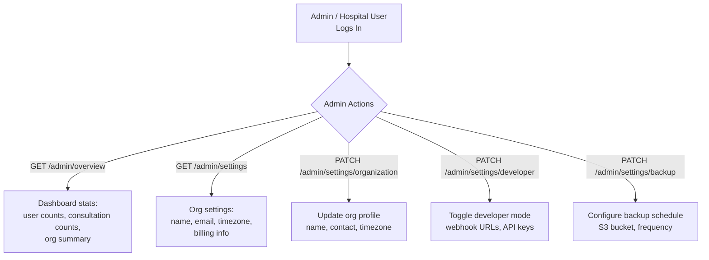
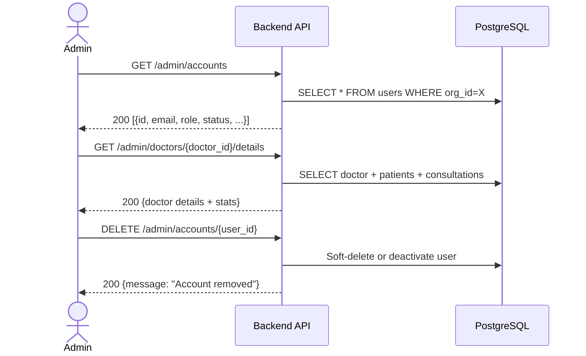
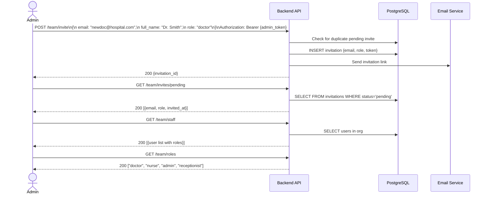
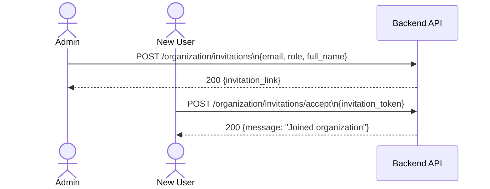
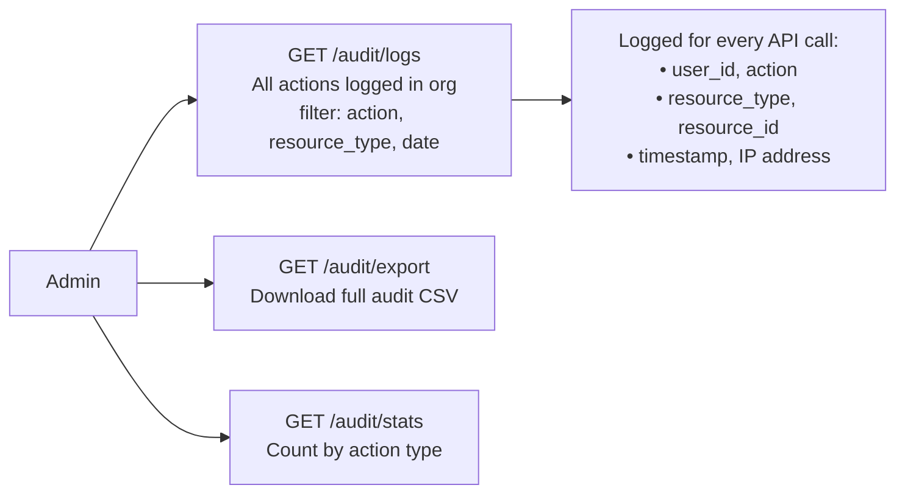

# Admin & Hospital Flow

## 1. Admin Overview



---

## 2. User Account Management



---

## 3. Team Management (Invite & Staff)



---

## 4. Organization Invitations (Self-Managed)



---

## 5. Audit Logs



---

## 6. Admin Role Access Map

```mermaid
flowchart TD
    subgraph roles["Role-Based Access"]
        A["admin / hospital"]
        B["doctor"]
        C["patient"]
    end

    A -->|full access| D[/admin/* endpoints]
    A -->|full access| E[/team/* endpoints]
    A -->|full access| F[/organization/* endpoints]
    A -->|full access| G[/audit/* endpoints]

    B -->|own org only| H[/doctor/* endpoints]
    B -->|own data| I[/calendar, /consultations, /documents]

    C -->|own data only| J[/patients/id, /documents]
    C -->|own history| K[/chat-history/patient]
