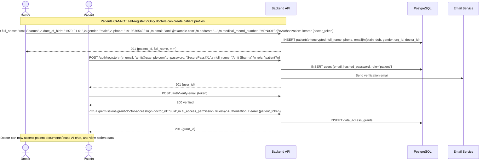
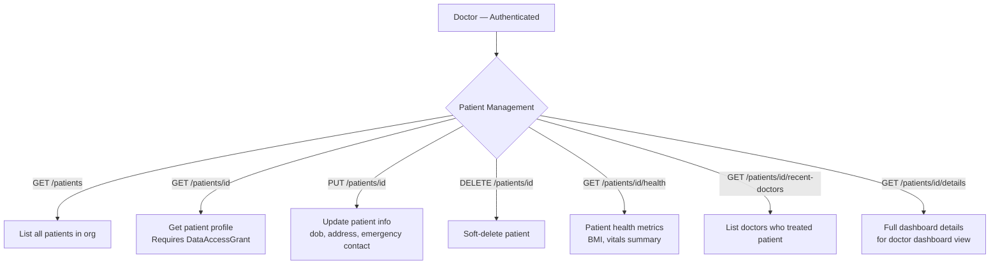
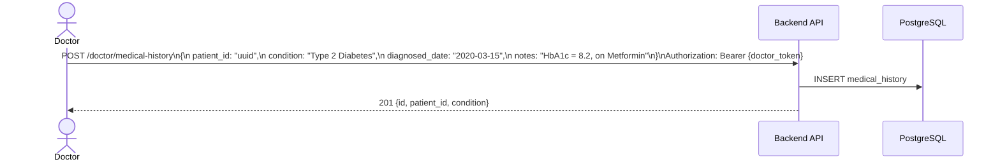
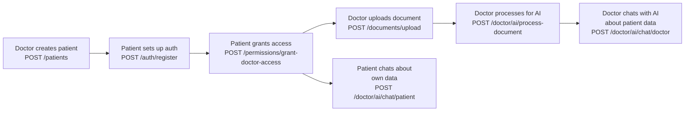

# Patient Onboarding Flow

## 1. Complete Patient Onboarding (Doctor-Led)



---

## 2. Doctor Manages Patient Data



---

## 3. Medical History



---

## 4. Patient Data Access Flow Summary



---

## 5. Doctor's Patient Overview Routes

```mermaid
flowchart LR
    A[Doctor Dashboard] --> B[GET /doctor/patients\nAll my patients]
    A --> C[GET /doctor/patients/id/documents\nPatient's uploaded docs]
    A --> D[GET /doctor/id/recent-patients\nLast seen patients]
    A --> E[GET /doctor/id/history\nFull consultation history]
    A --> F[GET /doctor/me/dashboard\nDoctor KPI dashboard]
