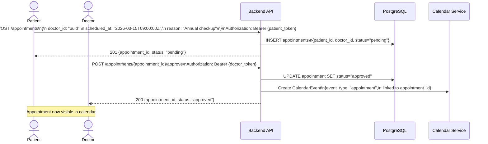
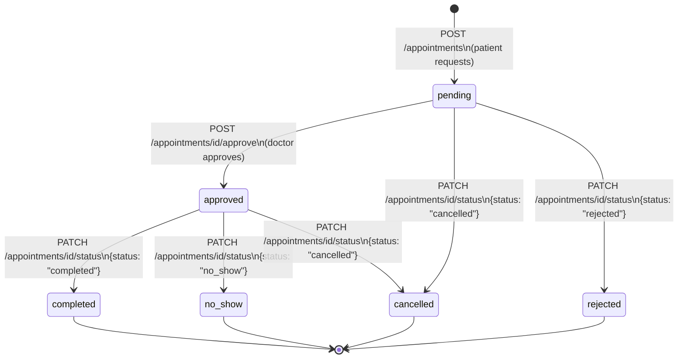
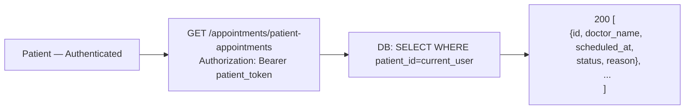

# Appointments Flow

## 1. Full Appointment Lifecycle



---

## 2. Appointment Status Lifecycle



---

## 3. Patient Views Their Appointments



---

## 4. Status Updates (Doctor / Admin)

```mermaid
flowchart TD
    A[Doctor / Admin] --> B{Update Method}

    B -->|PATCH /appointments/id/status\n{status: X}| C[Partial update\nonly the status field]

    B -->|PUT /appointments/id/status\n{status: X, notes: Y}| D[Full update with\nadditional fields]

    C --> E[CalendarEvent auto-updates\nvia calendar_service.sync_appointment]
    D --> E
```

---

## 5. Appointments vs Consultations — Key Difference

```mermaid
flowchart LR
    subgraph appt["Appointments"]
        A1[Requested by Patient]
        A2[Lightweight — date + doctor + reason]
        A3[No video link generated]
        A4[Visible in calendar as 'appointment' event]
    end

    subgraph consult["Consultations"]
        B1[Scheduled by Doctor]
        B2[Full — Google Meet link generated]
        B3[Supports SOAP note generation]
        B4[Tracks: notes, diagnosis, prescription]
        B5[Has queue metrics & urgency levels]
    end

    appt -->|Doctor can convert\nto a full consultation| consult
